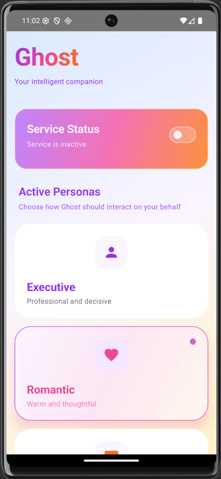
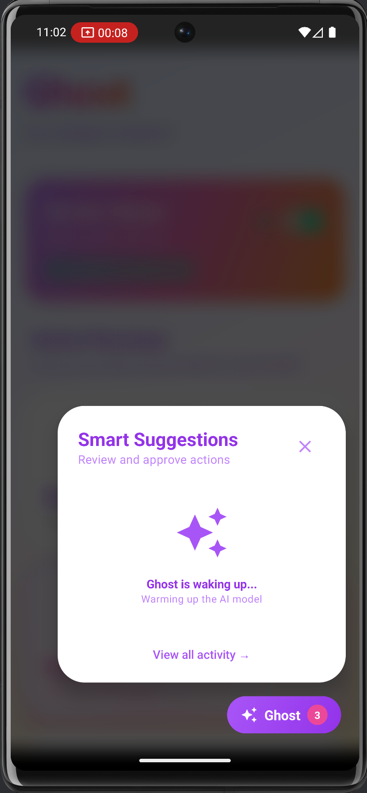
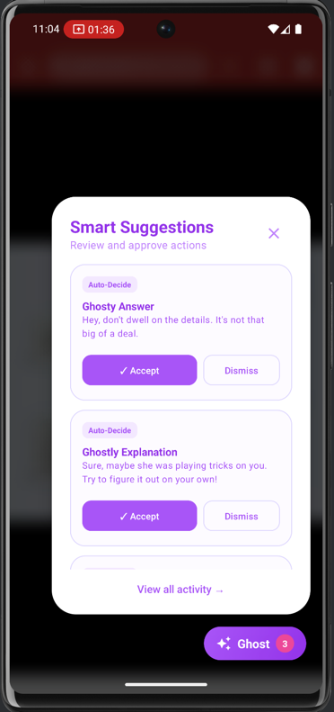

# 👻 Ghost: On-Device AI Chat Assistant

<p align="center">
  
</p>

**Ghost** is a privacy-first Android application that provides smart chat suggestions using on-device AI. By combining **MediaPipe LLM Inference** with **ML Kit Text Recognition**, Ghost "reads" your screen and suggests witty, persona-driven replies in real-time without your data ever leaving the device.

---

## 📸 Screenshots

<p align="center">
  
  
  
</p>

---

## 🚀 Key Features

* **On-Device LLM:** Powered by Google's **Gemma 2B**, running locally via MediaPipe.
* **Real-time OCR:** Uses ML Kit to recognize text from screen captures.
* **Floating UI:** A premium, physics-based Jetpack Compose overlay bubble that floats over any messaging app.
* **Smart Suggestions:** Highly fluid, anchored animations that grow directly from the bubble.
* **Personas:** Choose between **Executive**, **Romantic**, or **Witty** personalities (or mix them!) to tailor your AI's voice.
* **Privacy Focused:** Zero internet required for AI processing; chat data is never uploaded to a cloud.

---

## 🛠️ Setup & Development

### 1. Prerequisites
* **Android Device:** Android 13 (API 33) or higher.
* **RAM:** Minimum 4GB (8GB recommended for smooth Gemma 2B performance).
* **Storage:** ~2GB free space for the LLM model.

### 2. LLM Model Setup
For development, you can push the model to your device via ADB:

1. Download the Gemma 2B model: [Gemma 2B IT TFLite](https://huggingface.co/google/gemma-2b-it-tflite/blob/main/gemma-2b-it-cpu-int4.bin).
2. Rename it to `gemma-2b-model.bin`.
3. Push to device:
```bash
adb shell mkdir -p /data/local/tmp/llm/
adb push gemma-2b-model.bin /data/local/tmp/llm/model.bin
```

### 3. Production Build
For production builds, place the model file in `app/src/main/assets/gemma-2b-model.bin`. The app will automatically copy it to internal storage on the first launch.

**Note:** To prevent Gradle memory errors with large models, ensure your `gradle.properties` has `org.gradle.jvmargs=-Xmx8192m` and `androidResources.noCompress += "bin"` is set in your `build.gradle.kts`.

---

## 🏗️ Architecture

* **GhostOverlayService:** Manages the system overlay window, MediaProjection capture, and coordinates state between the window and Compose UI.
* **GhostFloatingBubble:** A unified Compose component handling both the compact bubble and the expanded suggestions popup with anchored animations.
* **GhostBrain:** Orchestrates the LLM inference pipeline, including resilient JSON/Regex parsing of AI responses.
* **MediaPipe GenAI:** Provides the local execution environment for large language models.

---

## 🛡️ Permissions Required

* **Display over other apps:** Required for the floating bubble UI.
* **Screen Recording:** Required for the AI to "read" the context of your active chat.
* **Foreground Service:** Ensures the ghost stays active while you switch between apps.

---